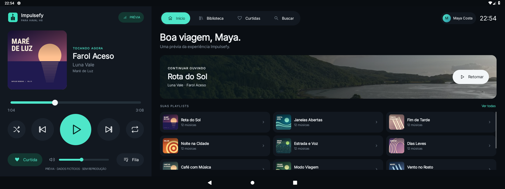
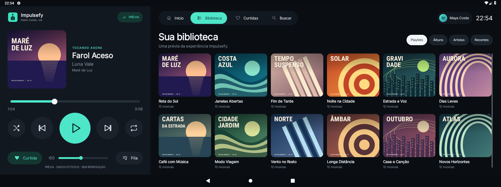
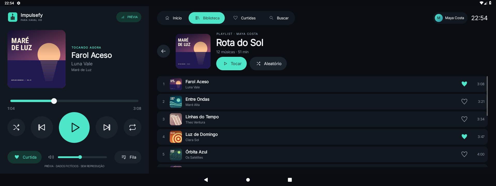

<p align="center">
  
</p>

<h1 align="center">Impulsefy</h1>

<p align="center">A native Spotify experience for your car.</p>

<p align="center">Android 6.0+ · Phone-based QR pairing · Local audio playback</p>

<p align="center"><strong>English</strong> · <a href="README.pt-BR.md">Português (Brasil)</a></p>

<p align="center"><a href="#build-and-install">Build</a> · <a href="#contributing">Contribute</a> · <a href="#license">License</a></p>

Impulsefy is an unofficial Spotify client built for Haval/GWM Android
infotainment systems. It combines a touch-friendly interface with local playback
powered by librespot and sign-in through your phone's browser. **Spotify Premium
and internet access are required for playback.** No Impulsefy server, personal
Spotify Client ID, or companion app is needed.

## Screenshots



| Library | Playlist |
| --- | --- |
|  |  |

[View all nine screens](docs/screenshots/README.md). Captured on an Android 9
emulator at 1920×720. Maya Costa, the artists, songs, and playlists are fictional;
the 12 covers are original vector illustrations. The login QR is illustrative.

## Features

- QR sign-in through the Spotify website on an Android phone or iPhone.
- Library views for playlists, albums, artists, and recently played tracks;
  liked songs, search filters, recent searches, and voice search where supported.
- Playback controls, shuffle, repeat, like/unlike, a local queue, and Android
  media controls through MediaSession.
- Native vehicle media volume on compatible Haval systems, with app-volume
  fallback on other devices. Android system bars remain available.
- A clearly labeled, account-free preview through **Conhecer a interface**
  (Explore the interface), with fictional data and no audio playback.

The queue contains the selection loaded in Impulsefy. Recent history holds up to
60 tracks and is cleared on sign-out. Offline downloads are not implemented.
The current interface is in Brazilian Portuguese.

**Status:** version 0.1.0. Pairing, library access, track search, playback, and
native volume have been verified on the vehicle. Some newer controls and catalog
operations still need complete live validation; see the
[development history and remaining checks](tasks/todo.md).

## Build and install

Build on macOS or Linux with:

- JDK 17 and Rust installed through rustup.
- Android SDK command-line tools (`sdkmanager`) on your `PATH`.
- Android SDK 36, Build Tools 36.0.0, and NDK 27.2.12479018.
- Android platform-tools (`adb`) for installation and emulator tests.

The app uses **compileSdk 36, minSdk 23, and targetSdk 28**. Configure your local
paths, then run:

```sh
export JAVA_HOME=/path/to/jdk-17
export ANDROID_HOME=/path/to/android-sdk
export PATH="$ANDROID_HOME/platform-tools:$PATH"
sdkmanager 'platform-tools' 'platforms;android-36' 'build-tools;36.0.0' 'ndk;27.2.12479018'
./scripts/build-apk.sh
```

This builds the ARM64 native library for Haval, runs R8 and release lint, and writes
`artifacts/impulsefy.apk` with a SHA-256 file alongside it. The script signs with
the machine's development key; retain that key to install future updates over
the same app. Running `./gradlew assembleRelease` without `-PlocalSigning=true`
after building the native libraries produces an unsigned release APK for your
own signing process.

The release APK contains only `arm64-v8a`, the architecture used by the tested
Haval head unit. The x86-64 build is reserved for emulator tests.

Select the intended device from `adb devices`, replace `DEVICE_SERIAL`, and install:

```sh
adb devices
adb -s DEVICE_SERIAL install -r artifacts/impulsefy.apk
```

Keep build products, signing keys, and local configuration out of Git. The
repository includes the Gradle wrapper and Cargo lockfile for reproducible inputs.

## Sign in

1. Open Impulsefy on the car. The sign-in screen generates a QR code automatically.
2. Scan it with your phone to open `https://spotify.com/pair` with the code filled in.
3. Sign in and confirm on Spotify. The car receives authorization automatically.

The saved credential is reused on later launches. Revoking the session or
clearing app data requires pairing again. The car requests device authorization
and refreshes tokens directly with Spotify; tokens and playback credentials are
encrypted with AES-GCM and a key in Android Keystore.

Library and search use the librespot session. This unofficial integration depends
on Spotify endpoint and public-client compatibility. The legacy login server has
been removed from the repository.

## Development

The UI uses Java and native Android Views. Rust handles Spotify sessions and
decoding through librespot; JNI connects it to AudioTrack and the Android service.

| Location | Purpose |
| --- | --- |
| `app/src/main/java/com/impulsefy/` | Screens, authentication, player service, artwork, and vehicle volume |
| `app/src/androidTest/` | Android regression checks and screenshot capture |
| `native/src/` | Rust playback engine, JNI bridge, and catalog operations |
| `native/proto/` | Protocol schemas used to generate Rust code during the build |
| `native/vendor/librespot-core/` | Vendored dependency with a documented Android pairing patch |
| `design/` | Pencil reference, logo, and design assets |
| `docs/screenshots/` | Latest screenshots with fictional data |
| `scripts/` | Build, test, and capture commands |
| `tasks/todo.md` | Development milestones and pending validation |

The [Pencil file](design/impulsefy.pen) is a design reference. The
[librespot compatibility patch](native/vendor/librespot-core/IMPULSEFY.md) aligns
the device-pairing client-token identity while preserving legacy sessions.

### Checks

From the repository root, with the build prerequisites configured:

```sh
cargo fmt --manifest-path native/Cargo.toml -- --check
cargo test --manifest-path native/Cargo.toml --locked
cargo clippy --manifest-path native/Cargo.toml --locked --all-targets -- -D warnings
```

For Android checks, start a test emulator without a signed-in Spotify account.
Build the native library for its ABI first: use `arm64-v8a` below for an ARM64
emulator, or replace it with `x86_64` for an x86-64 emulator.

```sh
./scripts/build-native.sh arm64-v8a
./gradlew lintDebug --console=plain
ANDROID_SERIAL=emulator-5554 ./scripts/test-android.sh
```

The Android script builds and installs the debug app and instrumentation on the
emulator. It checks navigation, rendered QR decoding, authorization and refresh,
Keystore, JNI, AudioTrack recovery, audio focus, volume, and preview privacy.
Authentication responses are mocked; these checks do not replace real-account
validation. The scripts reject physical-device serials.

### Refresh screenshots

Use an account-free Android 9 test emulator and build its native library as above.
The capture command updates all nine PNGs in `docs/screenshots/`:

```sh
adb -s emulator-5554 shell wm size 1920x720
adb -s emulator-5554 shell wm density 160
ANDROID_SERIAL=emulator-5554 ./scripts/capture-screenshots.sh
```

Keep the fictional profile and covers, and review the captures before committing.
Do not include personal account details, active pairing codes, or credentials.

## Contributing

Pull requests run automated Rust and Android checks. Once the workflows are on
`main`, a merged PR with successful CI can produce a signed APK release with an
automatically generated changelog. See [CI, releases, and signing](docs/releases.md)
for the versioning scheme and required GitHub Actions secrets.

Bug reports, device compatibility reports, documentation improvements, and
focused code changes are welcome.

1. Check existing issues and [pending tasks](tasks/todo.md). For a substantial
   feature, describe the use case and proposed scope in an issue first.
2. Fork the repository and create a branch for one focused change. Preserve the
   native UI, visible Android system bars, and the optional vehicle-volume fallback.
3. Run the checks relevant to your change. Include a regression check when fixing
   behavior; for documentation-only edits, verify links and commands.
4. Keep both READMEs aligned when changing setup or behavior. Use fictional data
   in UI screenshots and preserve third-party license and attribution notices.
5. Open a pull request describing the problem, the resulting behavior, the
   validation performed, and any checks still pending. Add before/after captures
   for visible UI changes.

For a bug report, include the vehicle/head-unit model, Android and app versions,
steps to reproduce, expected and actual behavior, and sanitized logs if available.
A vehicle test should be performed while parked. Never post tokens, cookies,
passwords, signing keys, or personal account data in an issue or pull request.

AI coding agents should read [AGENTS.md](AGENTS.md) before making changes. It maps
the codebase and documents implementation constraints and validation commands.

## License

Impulsefy's source code is licensed under **GNU AGPLv3**; see [LICENSE](LICENSE).

- Use, modification, redistribution, and commercial use are permitted.
- Distribution requires preserving notices and providing corresponding source
  under the license's terms, including for covered modifications.
- If users interact with your modified version over a network, it must offer
  those users its corresponding source, as specified in section 13.

This is a summary; the [full AGPLv3 text](https://www.gnu.org/licenses/agpl.en.html)
governs. Contributions to Impulsefy's code should use the same license.

Third-party components and assets retain their own licenses. Key examples:

| Component | License / credits |
| --- | --- |
| librespot and the vendored `librespot-core` | [MIT](native/vendor/librespot-core/LICENSE) |
| ZXing core | [Apache 2.0](https://github.com/zxing/zxing/blob/zxing-3.5.4/LICENSE) |
| Inter typeface | [SIL Open Font License 1.1](app/src/main/assets/fonts/OFL.txt) |
| Included Unsplash photographs | [Unsplash License](https://unsplash.com/license); authors listed in [artwork credits](app/src/main/assets/artwork-credits.txt) |

Additional dependencies have their own upstream terms; retain their notices when
redistributing. Spotify music, catalog artwork, and trademarks are not licensed
by this repository.

Thanks to [librespot](https://github.com/librespot-org/librespot) for the playback
engine, [go-librespot](https://github.com/devgianlu/go-librespot) for the device
pairing reference, and [Spotifast](https://github.com/crmne/spotifast) for
architecture and authentication references. Impulsefy is an independent project,
not affiliated with Spotify or Haval/GWM.
