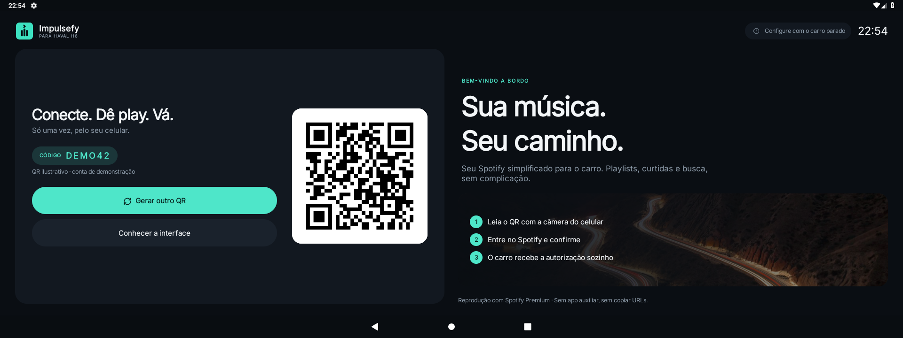
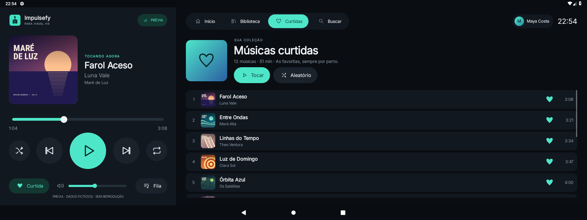
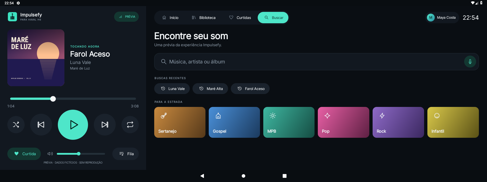
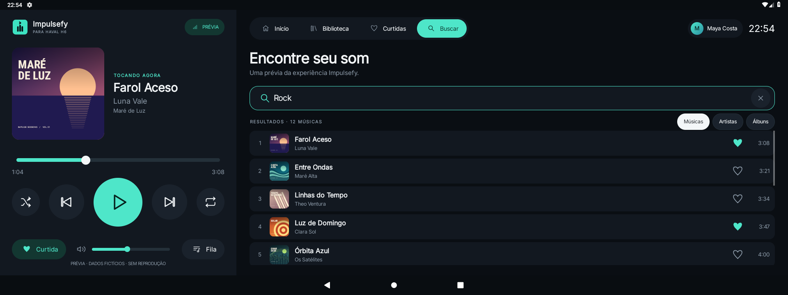
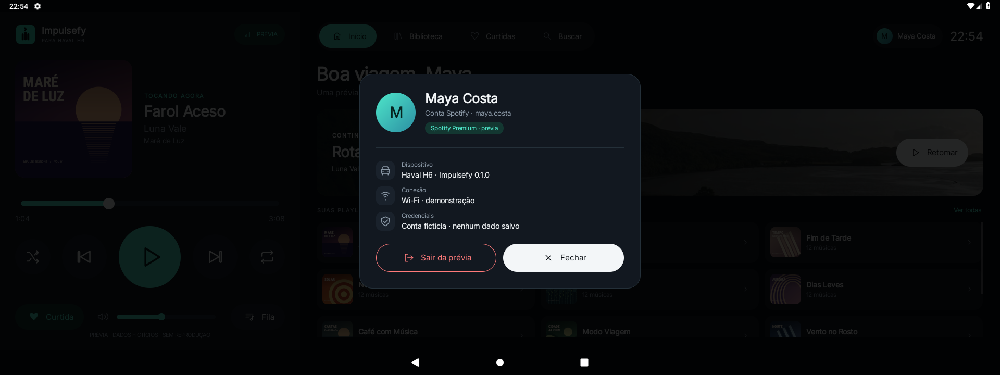
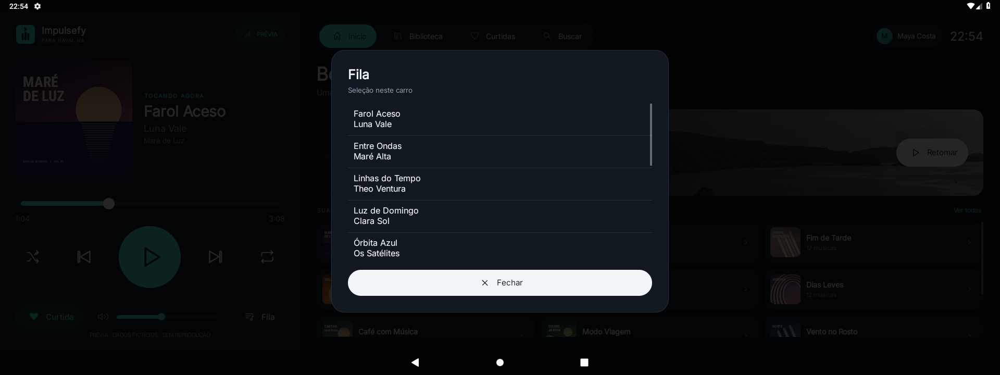

# Impulsefy screenshots

Real app screenshots captured on an Android 9 emulator at 1920 × 720, density
160 dpi. Maya Costa, the artists, songs, albums and playlists are fictional.
The album covers are original vector illustrations rendered by the app.
The preview does not play audio or use a Spotify account. The login QR and code
are mocked and cannot authorize an account.

## Login



## Home


## Library


## Playlist


## Liked songs



## Search



## Search results



## Account



## Queue



## Capture again

Use a test emulator without a signed-in Spotify account, with the display size
and density listed above, and the Android SDK/JDK described in the project README:

```sh
ANDROID_SERIAL=emulator-5554 ./scripts/capture-screenshots.sh
```

The script builds and installs the debug app and its screenshot instrumentation,
opens the existing screens using offline fixtures, and saves PNGs in this folder.
It rejects physical devices. The mock authentication transport exists only in
`androidTest`; production authentication is unchanged.
